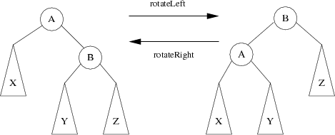

# Self Balancing Trees

Self Balancing Trees are augmented trees that provide us with operations like insert and find in O(log(n)) time. Some of the self balancing trees are:

## [AVL Trees](./avl_tree.cpp)
AVL Trees are self-balancing after every insertion/deletion because the absolute difference in between the heights of the left subtree and the right subtree of a node is maximum 1. AVLs are named after their inventors: Adelson-Velsky and Landis.

For proving they are having max height O(log(n)). Check for the smallest number of nodes needed to make h given that we add in imbalance at each node. `N(h) = N(h-1) + N(h-2) + 1`. Worst case comes out to be O(1.44log(n)) using fibonacci comparison.

An AVL seems to be the best data structure in Database Theory.

### Find

Same as bst go left/right or have the value

### Insertion

- insert just like bst move to parent->left or parent->right if parent is not null else insert at parent and return the node so that we can change left or right child
- update the height of parent node
- is parent is not balanced call `repair` on parent and update parent
- finally return parent

### Repair

- if node is left heavy
	- if left child is left heavy or balanced then call in right rotate of node and update node
	- else call in left rotate of left child update left child then call right rotate of node and update node
- if node is right heavy
	- if right child is right heavy or balanced then call in left rotate of node and update node
	- else call in right rotate of right child and update right child then call left rotate of node and update node
- finally return node

### Rotation

- Left Rotate
- Right Rotate

both will return updated node and inside the calls update the node heights and pointers too. height has to updated for node and right and left child respectively

## Red Black Trees

Red-Black tree is a self-balancing binary search tree in which each node contains an extra bit for denoting the color of the node, either red or black. A red-black tree satisfies the following properties:

- Red/Black Property: Every node is colored, either red or black.
- Root Property: The root is black.
- Leaf Property: Every leaf (NIL) is black.
- Red Property: If a red node has children then, the children are always black.
- Depth Property: For each node, any simple path from this node to any of its descendant leaf has the same black-depth (the number of black nodes).

The self balance is maintained by depth property such that any simple path from the root to a leaf is not more than twice as long as any other such path.

RBTs are used to organize pieces of comparable data, such as text fragments or numbers. In the version 8 of Java, HashMaps are implemented using RBTs. Data structures in computational geometry and functional programming are also built with RBTs.

## Splay Trees

In Splay trees, recently accessed nodes can be quickly accesed again, thus the amortized time complexity of any operation is still O(log n). Splay trees don’t need to store any bookkeeping data.

Splay trees are used for caches, memory allocators, garbage collectors, data compression, ropes (replacement of string used for long text strings), in Windows NT (in the virtual memory, networking, and file system code).

## Comparison

AVLs are the fastest in practice for searching elements, but the rotation of subtrees for self-balancing is costly. meanwhile, RBTs provide faster insertions and deletions because there are no rotations.
